<!-- Output copied to clipboard! -->

<!-----

You have some errors, warnings, or alerts. If you are using reckless mode, turn it off to see inline alerts.
* ERRORs: 0
* WARNINGs: 1
* ALERTS: 15

Conversion time: 4.275 seconds.

Using this Markdown file:

1. Paste this output into your source file.
2. See the notes and action items below regarding this conversion run.
3. Check the rendered output (headings, lists, code blocks, tables) for proper
   formatting and use a linkchecker before you publish this page.

Conversion notes:

* Docs to Markdown version 1.0β33
* Sun Jan 30 2022 06:59:59 GMT-0800 (PST)
* Source doc: Report

WARNING:
You have some equations: look for ">>>>>  gd2md-html alert:  equation..." in output.

* Tables are currently converted to HTML tables.
* This document has images: check for >>>>>  gd2md-html alert:  inline image link in generated source and store images to your server. NOTE: Images in exported zip file from Google Docs may not appear in  the same order as they do in your doc. Please check the images!

WARNING:
You have 7 H1 headings. You may want to use the "H1 -> H2" option to demote all headings by one level.

----->

>>>>>  gd2md-html alert:  ERRORs: 0; WARNINGs: 2; ALERTS: 15.

<ul style="color: red; font-weight: bold"><li>See top comment block for details on ERRORs and WARNINGs. <li>In the converted Markdown or HTML, search for inline alerts that start with >>>>>  gd2md-html alert:  for specific instances that need correction.</ul>

Links to alert messages:
<a href="#gdcalert1">alert1</a>
<a href="#gdcalert2">alert2</a>
<a href="#gdcalert3">alert3</a>
<a href="#gdcalert4">alert4</a>
<a href="#gdcalert5">alert5</a>
<a href="#gdcalert6">alert6</a>
<a href="#gdcalert7">alert7</a>
<a href="#gdcalert8">alert8</a>
<a href="#gdcalert9">alert9</a>
<a href="#gdcalert10">alert10</a>
<a href="#gdcalert11">alert11</a>
<a href="#gdcalert12">alert12</a>
<a href="#gdcalert13">alert13</a>
<a href="#gdcalert14">alert14</a>
<a href="#gdcalert15">alert15</a>

>>>>> PLEASE check and correct alert issues and delete this message and the inline alerts.

# ELECTRICAL PRICE PREDICTION

Authors: Weipeng Zhang, Soham Shinde, Mingni Luo, Ziyue Wang

# **Summary** 

Forecasting in energy markets is identified as one of the highest leverage contribution areas of Machine Learning towards transitioning to a renewable based electrical infrastructure. 

The dataset contains hourly data for Energy Generation, Consumption, Pricing and Weather from years 2015 to 2018 for Spain. There are two CSV files: _energy_dataset.csv _and _weather_features.csv_. Both of them are time-series data having sizes (35064 x 29) and (178396 x 17) respectively. There are four types of features: _date information, energy, weather and price information_, which includes all 43 features.

The goal of the project is to predict the electrical price by the time of the day using generation, consumption and weather data and also analyze what features influence electrical price the most in Spain. After data wrangling and feature engineering, we implemented time-series models, boosting models and also LSTM model to tackle this problem. We compared RMSE of all models and analyzed the result to figure out which model and features are more suitable for this problem. 

# **Methods**

## EDA

Since the dataset is time series, we assume there are some patterns behind it. For the exploratory data analysis part, our goal is trying to find some clues for feature engineering and 

selection. 

First of all, we checked the distribution of electricity price by year [Fig1], month, week level.

>>>>>  gd2md-html alert: inline image link here (to images/image1.png). Store image on your image server and adjust path/filename/extension if necessary.  (<a href="#">Back to top</a>)(<a href="#gdcalert2">Next alert</a>) >>>>> 

                _Fig 1. Distribution of price by 3 years_

>>>>>  gd2md-html alert: inline image link here (to images/image2.png). Store image on your image server and adjust path/filename/extension if necessary.  (<a href="#">Back to top</a>)(<a href="#gdcalert3">Next alert</a>) >>>>> 

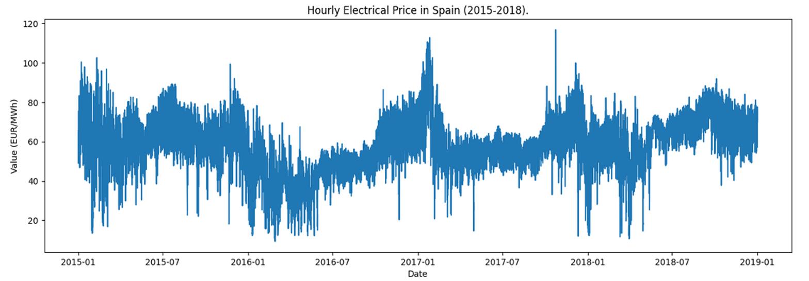

                _Fig 2. Distribution of mean price by year_

It's hard to see every detail of the data if we visualize its distribution by year. But it's clear that the shape of this distribution is like a repetitive curve. We have more confidence that it has some patterns behind it. So we need to split the data into smaller groups.

>>>>>  gd2md-html alert: inline image link here (to images/image3.png). Store image on your image server and adjust path/filename/extension if necessary.  (<a href="#">Back to top</a>)(<a href="#gdcalert4">Next alert</a>) >>>>> 

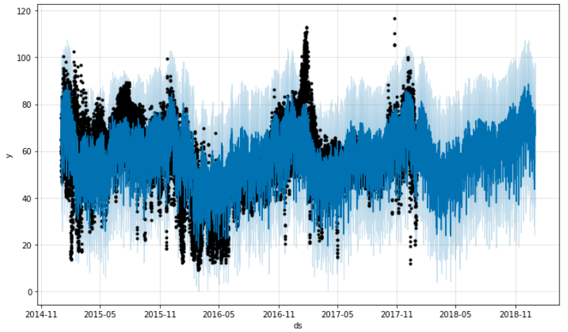

                _Fig 3. Distribution of mean price by month_

>>>>>  gd2md-html alert: inline image link here (to images/image4.png). Store image on your image server and adjust path/filename/extension if necessary.  (<a href="#">Back to top</a>)(<a href="#gdcalert5">Next alert</a>) >>>>> 

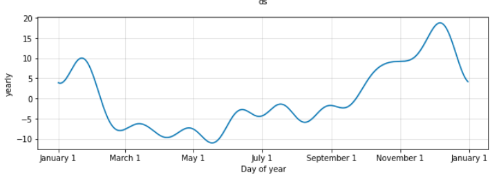

                _Fig 4. Distribution of mean price by week_

Now we have some assumptions by these plots:

1. Price is affected by seasonality 
2. Price is affected by temperature

To verify our assumptions, we need to compare the distribution of price and temperature.

>>>>>  gd2md-html alert: inline image link here (to images/image5.png). Store image on your image server and adjust path/filename/extension if necessary.  (<a href="#">Back to top</a>)(<a href="#gdcalert6">Next alert</a>) >>>>> 

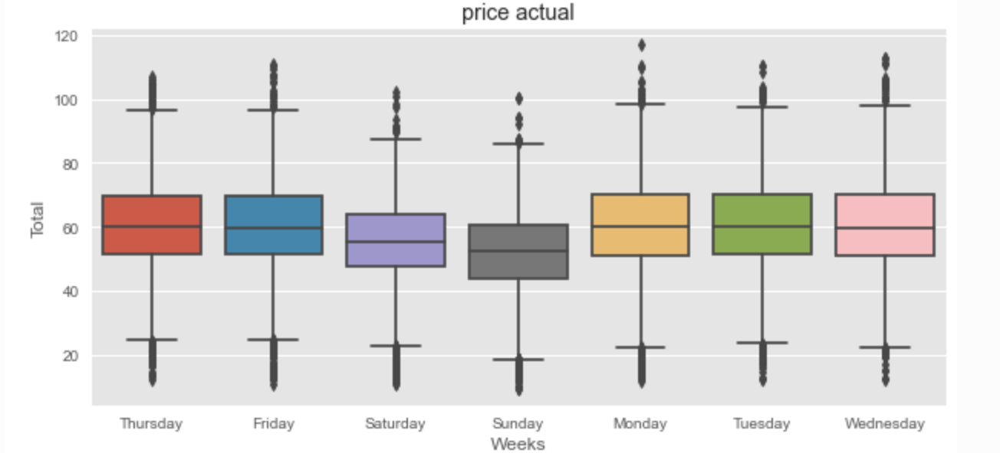
 

        _Fig 5. Distribution of price and temperature by month_

The price will become more expensive when the temperature is lower or higher, which means temperature is a vital feature for our goal. Also we plot the correlation plot to help us decide better later [Fig A1].

## Preprocessing

### Outliers Detection

We detected the outliers in our weather data. By looking at the distribution of individual features, it shows that there are extremely large values in pressure and wind speed [_Fig A2_]. In addition, there are heavy rain and snow during the summer of 2016 and winter of 2015. We replaced these abnormal values with NAs and then imputed them. 

### NA Imputation

First, we checked the NA values in the energy data and weather data. It shows that _generation hydro pumped storage aggregated_ and _forecast_ _wind offshore eday ahead_ in energy data have 100% NA values. So we marked these two columns as invalid features and will drop them later. In terms of other columns which do not have that many missing values, we imputed them with certain strategies. The reason we did not drop those rows is that since this is time-series data, we need to guarantee the continuity of each row, to prevent any issues that will potentially damage the prediction. First, we tried imputing them by the value of the last valid row. And then we also tried imputing those values linearly, which is imputing them with the values that make the context values increase or decrease linearly with equal intervals. In the model-building part, the results demonstrated that linear imputation is better so we kept that.

### Column Drop

Besides the columns that we mentioned in the NA imputation, we also found invalid columns like 'generation fossil coal-derived gas', 'generation wind offshore', etc. which contain 99% zero values. Additionally, the energy data contains forecasted features like 'total load forecast', 'price day ahead', 'forecast solar day ahead', 'forecast wind onshore day ahead' from TSO. In order to compare our prediction results with theirs, and prevent data leakage problems, we dropped these columns as well.

### Data Merge

As mentioned, the data we used to predict the model contains two files, one is energy data, the other is weather data. The goal of our project is to predict the electricity price based on energy-related data and also weather data. So we need to combine them together. We can do that by joining these two data frames together by the time column. But since the weather data file contains weather information in 5 cities in Spain, we need to handle them first. The easiest way could be directly calculating the mean value of all the features. But we also tried utilizing the data in different cities and pivoting wider with extra columns. In the modeling part, it shows longer training time and worse RMSE value, so we dropped this approach.

### Data Shift

To convert the data into the format that fits the classical regression models, we created a new column called `price_tomorrow` by shifting our target column ‘price’ one day ahead. By doing this, we can train the model properly. However, for our time-series models, we predicted the rows by previous data, so it’s not necessary to perform this.

## Feature Engineering

In the feature engineering part, we generated five different types of features. 

* The first type is statistical indexes in groups. These features were generated by calculating certain statistical values of specified variables of specified groups, such as the mean price of this week, mean price of this month. 
* The second type is historical value. We took the historical value of a specified variable as a new feature, such as price of an hour ago, price of a week ago. 
* The third type is date features like day of week and day of month. These features were generated directly from the date-time of the row.
* The fourth type is statistical indexes in sliding windows. We calculated statistical indexes in a sliding window, such as the mean price of the last 6 hours. 
* The last type is the trend of variables, such as the growth rate of price in the last hour and the growth rate of price of this month. 

We finally generated 50 new features, making the number of features used for training become 85.

## Modeling

### Classical Regression Model

We used the features generated from the feature engineering part as the input of 7 different models: linear regressor, ridge regressor, lasso regressor, random forest regressor, LightGBM, XGBoost, and CatBoost. We used the last ¼ part of the train set as the valid set for the training process. The gradient boosting models performed better among all models and CatBoost was the best. We took the average of the predictions of these 7 different models as our final prediction and the RMSE came down to 6.0847.

Then we performed feature selection on the input. We got three different feature importance tables from the trained LightGBM, XGBoost, and CatBoost models and then filtered out the last 10 features with the lowest feature importance. We used the filtered features to train the models again and lowered the final RMSE down to 6.0187.

### Time Series Model

Time series data is a collection of observation values obtained through repeated measurements over time. The frequency for the same can be Annual, Monthly, Weekly, Daily or even second-wise. They have a natural temporal ordering. Being complex, the time series models make an assumption that the data is suitably prepared before fitting.

There are two types of analysis that can be done. Firstly, the univariate analysis in which we considered the series with a single time-dependent variable. Eg.  AR, ARIMA, Prophet model.

Whereas in Multivariate analysis, the time series is dependent on more than one time-dependent variable. Eg. VAR, Prophet model.

**ARIMA  **

ARIMA stands for Auto-Regressive Integrated Moving Average. It explains a given time series based on its own lags and lagged forecast errors. This model is characterised by 3 terms (p,d,q):

* p is the order of the AR term ie. The number of lags of Y to be used as predictors.
* d is the minimum number of differencing required to make the time.
* q is the order of the MA term ie. number of lagged forecast errors.

This model assumes that the data is stationary which makes it mandatory to check for stationarity of the data and correct it. Kwiatkowski–Phillips–Schmidt–Shin (KPSS) test is used for hypothesis tests. We accepted the null hypothesis for the stationary data.

	_H0: Null hypothesis: the series is stationary._

_H1: Alternative Hypothesis: the series is not stationary._

If the data is not found to be stationary, then we need to do some minimum number of necessary transformations like differencing so as to make it stationary (d). The value for p and q parameters is determined using Partial Autocorrelation Function (PACF) and Auto Correlation Function (ACF) plots. Then, we can manually pass the parameters to model for predictions.

Auto-ARIMA variation can be used to automatically calculate the best combination of (p,d,q) based on Akaike's Information Criteria (AIC) value.

>>>>>  gd2md-html alert: inline image link here (to images/image6.png). Store image on your image server and adjust path/filename/extension if necessary.  (<a href="#">Back to top</a>)(<a href="#gdcalert7">Next alert</a>) >>>>> 

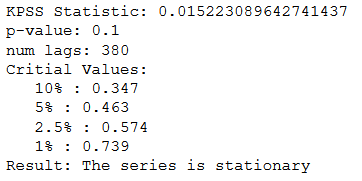

_Fig 6. ARIMA model_

We can extend the ARIMA model to multivariate analysis by using the Vector AutoRegression (VAR) model which includes other time-series data along with target series. Besides the generic steps of ARIMA, we also need to perform Granger Causality Test which determines whether a time series causes another time-series and accordingly consider the variables.

_	H0: Null Hypothesis: xt does not granger-causes yt_

_H1: Alternative Hypothesis:  xt granger-causes yt_

**PROPHET**

PROPHET is based on an additive model released by Facebook. It provides for both types of analysis. In Univariate analysis, the response variable to ‘y’ response parameter as well as to ‘ds’ predictor parameter. The Prophet Model needs to be given a period to make its predictions by initializing the ‘future’ parameter. In our case, the model is trained on data for years 2015-2017 and values for 2018 are predicted. We can visualize the components of the time series using this model [Fig A4]. In Multivariate analysis, we added other correlated variables as regressors to the model to get the prediction [Fig A5].

	

>>>>>  gd2md-html alert: inline image link here (to images/image7.png). Store image on your image server and adjust path/filename/extension if necessary.  (<a href="#">Back to top</a>)(<a href="#gdcalert8">Next alert</a>) >>>>> 

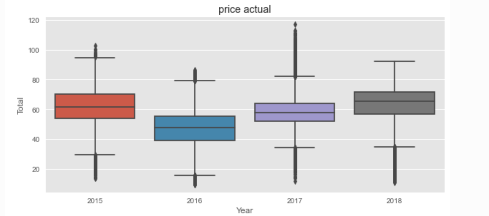

_Fig 7. PROPHET model_

**LSTM**

Long short-term memory (LSTM) is an artificial recurrent neural network (RNN) architecture used in the field of deep learning.[1] Unlike standard feedforward neural networks, LSTM has feedback connections. So it would be perfect for time series data prediction. 

For training and validation data, we split them with 3:1. As one of the RNN models, LSTM is super sensitive to the Input. It is important to scale features before training the model. Here we used MinMaxScaler in SKlearn to do the normalization. 

>>>>>  gd2md-html alert: equation: use MathJax/LaTeX if your publishing platform supports it.  (<a href="#">Back to top</a>)(<a href="#gdcalert9">Next alert</a>) >>>>> 

The scaled data should only be computed using the training data so we only fit the scaler with training data. And then we transform the data into a 3d array with the shape of [samples, timesteps, features]. Here we need to predict the electricity price the next day, so the timesteps would be 24. After training the model, we got RMSE 4.4456 for the test data, which is the best we got so far [Fig A6].

# **Results**

<table>
  <tr>
   <td>Model
   </td>
   <td>Linear Regressor
   </td>
   <td>Ridge Regressor
   </td>
   <td>Random Forest 
   </td>
   <td>LightGBM
   </td>
   <td>XGBoost
   </td>
   <td>CatBoost
   </td>
  </tr>
  <tr>
   <td>RMSE
   </td>
   <td>6.982
   </td>
   <td>6.980
   </td>
   <td>6.47
   </td>
   <td>6.27
   </td>
   <td>6.39
   </td>
   <td>6.21
   </td>
  </tr>
</table>

_Table 1. RMSE value for classical regression models_

<table>
  <tr>
   <td>Model
   </td>
   <td>ARIMA
   </td>
   <td>VAR
   </td>
   <td>Prophet Uni.
   </td>
   <td>Prophet Multi.
   </td>
   <td>LSTM
   </td>
  </tr>
  <tr>
   <td>RMSE
   </td>
   <td>14.15
   </td>
   <td>14.08
   </td>
   <td>13.21
   </td>
   <td>9.90
   </td>
   <td>4.45
   </td>
  </tr>
</table>

_Table 2. RMSE value for time series models_

In the case of Time-Series models, the LSTM model has the most accuracy followed by the Prophet and then the ARIMA models. For classical regression models, CatBoost has the best performance among all. We further compared our prediction result with the forecast value from the Transmission Service Operator (TSO). It shows that the RMSE value of our best model is 45% less than TSO, which verified that our prediction is better than theirs [Fig A7].

The variables having the most importance for the prediction of electricity price are ‘day of the week’, ‘fossil oil generation’, ‘biomass generation’, ‘hour of the day’ along with other feature engineered variables. In weather data, it’s interesting to note that volume of rain and snow do not have a large impact on the actual price.

# **Discussion**

In the power market, the electricity price is an essential element because it influences the behavior of power generation enterprises, power supply enterprises, and other buyers. [2]

First of all, for the entire power system, electricity price forecasting solves the problem of shortage of capacity in certain periods and large amounts of surplus in certain periods to a certain extent.

For the users, if we can get an accurate prediction of electricity price, it can allow users to better control budgets. They can formulate a reasonable electricity consumption plan according to actual needs.

From the perspective of generators, accurate electricity price forecasting is conductive to accurately grasp the market trend and market opportunities, so as to construct the optimal electricity and electricity price bidding strategy in order to obtain the maximum profit. From the perspective of power investors, long-term electricity price forecasting helps them make correct investment decisions and reduce investment risks.

An accurate forecasting electricity price model will be required by governments, enterprises, and users in various countries.

In future work, to improve the Time-Series Models, SARIMA (an ARIMA model which handles the seasonality) can be used. Also, the reason for the underfitting of time series models can be explained. To improve the performance of the classical regression models, further feature engineering operations can be conducted. We believe that applying stepwise feature selection can also help to improve the performance and efficiency of the classical regression models.

# **Statement of Contributions**

Ziyue Wang: Performed extra data preprocessing methods, and implemented the LSTM model.

Soham Shinde: Time Series analysis with implementation of specific models of ARIMA, VAR and Prophet.

Mingni Luo: exploratory data analysis part and ARIMA model. 

Weipeng Zhang: Responsible for the framework of the code, including exploratory data analysis, data preprocessing, feature engineering, building and training classical regression models.

# **References**

Dataset used : [https://www.kaggle.com/nicholasjhana/energy-consumption-generation-prices-and-weather](https://www.kaggle.com/nicholasjhana/energy-consumption-generation-prices-and-weather)

[1] Sepp Hochreiter; Jürgen Schmidhuber (1997). "Long short-term memory". Neural Computation. 9 (8): 1735–1780. doi:10.1162/neco.1997.9.8.1735. PMID 9377276. S2CID 1915014.

[2] D. Liu and H. H. Qiao, “A review of electricity price forecasting in deregulated electricity markets,” Shaanxi Electric Power, vol. 39, no. 8, pp. 27–32+41, 2011.

# **Appendix**

>>>>>  gd2md-html alert: inline image link here (to images/image8.png). Store image on your image server and adjust path/filename/extension if necessary.  (<a href="#">Back to top</a>)(<a href="#gdcalert10">Next alert</a>) >>>>> 

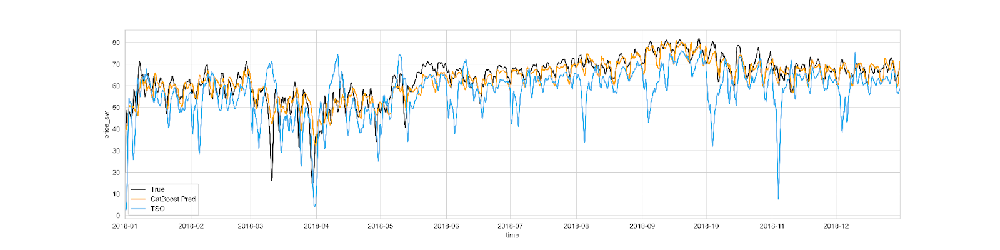

                _Fig A1. Correlation matrix_

>>>>>  gd2md-html alert: inline image link here (to images/image9.png). Store image on your image server and adjust path/filename/extension if necessary.  (<a href="#">Back to top</a>)(<a href="#gdcalert11">Next alert</a>) >>>>> 

                _Fig A2. Outliers in pressure_

>>>>>  gd2md-html alert: inline image link here (to images/image10.png). Store image on your image server and adjust path/filename/extension if necessary.  (<a href="#">Back to top</a>)(<a href="#gdcalert12">Next alert</a>) >>>>> 

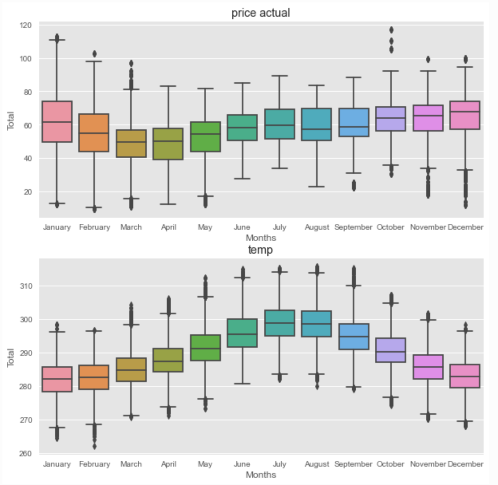

_Fig A3. KPSS test_

>>>>>  gd2md-html alert: inline image link here (to images/image11.png). Store image on your image server and adjust path/filename/extension if necessary.  (<a href="#">Back to top</a>)(<a href="#gdcalert13">Next alert</a>) >>>>> 

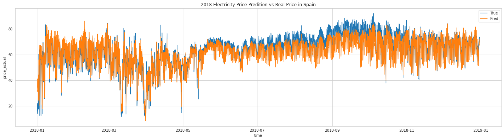

_Fig A4. Annual component of Prophet forecast_

>>>>>  gd2md-html alert: inline image link here (to images/image12.png). Store image on your image server and adjust path/filename/extension if necessary.  (<a href="#">Back to top</a>)(<a href="#gdcalert14">Next alert</a>) >>>>> 

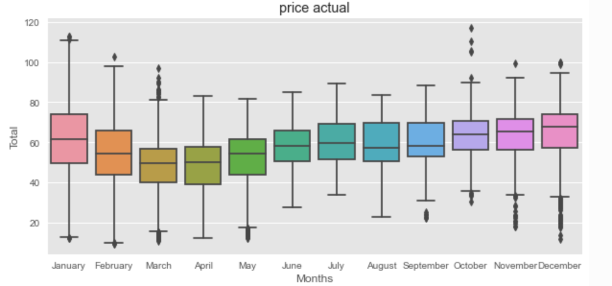

_Fig A5. Electrical price prediction using multivariate Prophet modeling_

>>>>>  gd2md-html alert: inline image link here (to images/image13.png). Store image on your image server and adjust path/filename/extension if necessary.  (<a href="#">Back to top</a>)(<a href="#gdcalert15">Next alert</a>) >>>>> 

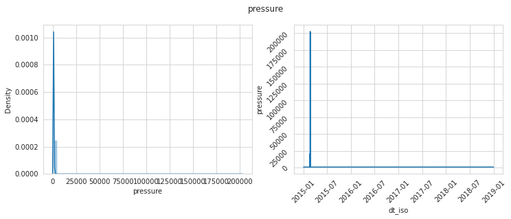

_Fig A6. Electricity Price Prediction VS Real Price in Spain in 2018_

>>>>>  gd2md-html alert: inline image link here (to images/image14.png). Store image on your image server and adjust path/filename/extension if necessary.  (<a href="#">Back to top</a>)(<a href="#gdcalert16">Next alert</a>) >>>>> 

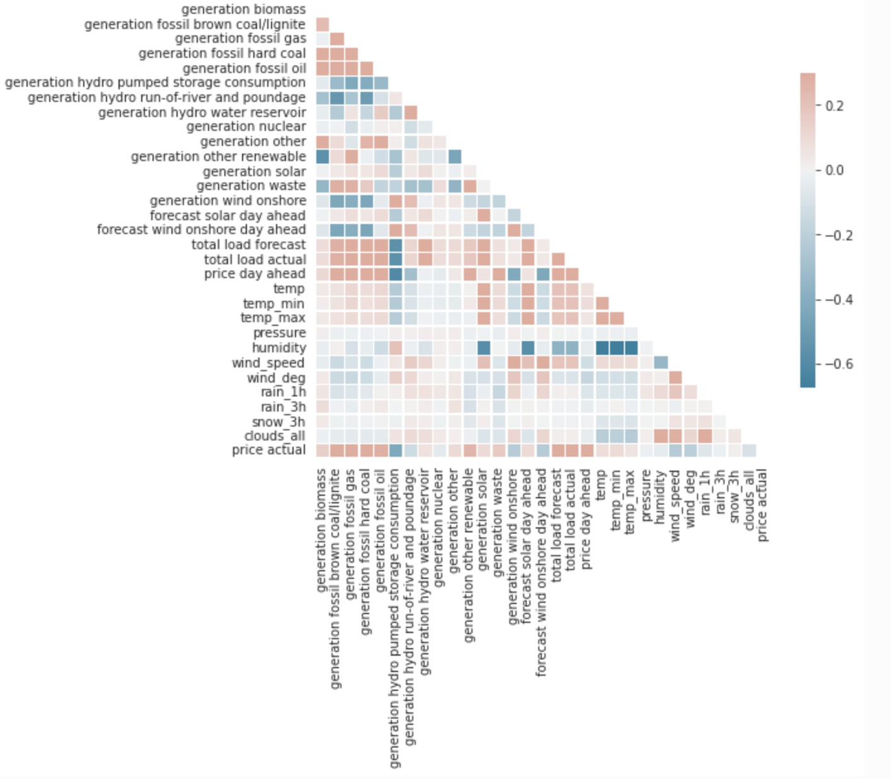

_Fig A7. Price of TSO, real and our predicted comparison_

